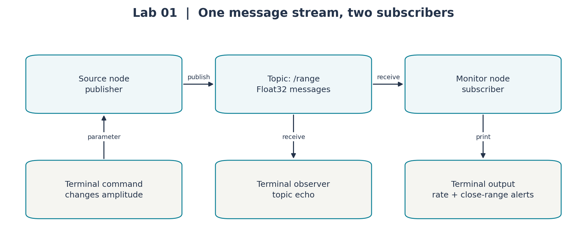
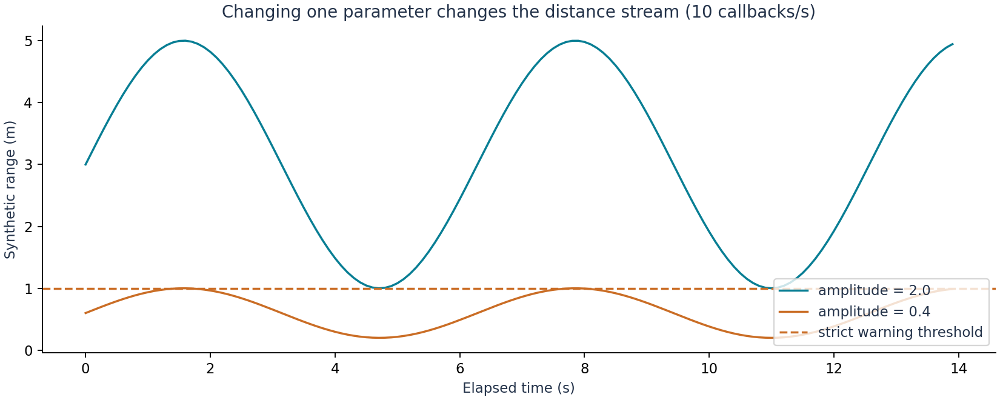

# Lab 1: Your first ROS 2 conversation

**Today you will:** run two small programs, watch a number travel between them,
and make the receiving program react to that number. This is the same basic
pattern the robot will later use to receive sensor readings and send commands.
You do not need previous robotics knowledge.

Use [Start here](../README.md) to prepare three terminals, labelled A, B and C.
No Gazebo simulation is required today. Plan 15 minutes for the tools, 20 for
the supplied stream, 50 to build your package, 25 for parameter/interface tests
and 10 to save your work. Keep the longer code explanations open as a reference.

## 1. What are we trying to build?

Imagine a small robot delivering an item across a room. It needs to measure
nearby obstacles, decide which way to move, and command its wheels. Those tasks
do not all happen at the same speed. A sensor may deliver readings ten times
per second while route planning happens less often. We therefore build the
system from cooperating components that exchange clearly defined data.

For our first component, use a much smaller task: a program produces a distance
reading, and another program prints an alert when the reading is below 1 metre.
We will generate the reading in Python today. Later a simulated laser sensor
will supply real measurements of a simulated room.

## 2. Meet the tools you will use

**ROS 2**, short for Robot Operating System 2, is a set of libraries and tools
for building robot software. Your computer still runs Ubuntu as its operating
system. ROS 2 helps programs exchange messages, organise their interfaces,
start together and be inspected while they run. We use the Jazzy release in
this course so everyone works with the same expected environment.

**Gazebo** is the simulator. It contains a virtual world, a robot model, physics
and simulated sensors. When our software commands motion, Gazebo calculates how
the robot moves and what its sensors should measure. This lets us develop and
test without needing a physical robot at every desk. We use Gazebo Harmonic.

**RViz** is a viewer for ROS data. It can display a robot model, sensor points,
maps and paths. Gazebo calculates the simulated world; RViz helps us inspect
what the robot's software knows about it. RViz can also display a stationary
robot model with no physics simulation running, which we will do in Lab 2.

**Python** is the language we use to write most of our algorithms. `rclpy` is
the Python library that lets a Python program participate in ROS 2. The
**terminal** is where you start programs and inspect their data.

| Tool | What you will use it for | First use in this sequence |
|---|---|---|
| ROS 2 | Connect programs and inspect their messages | Send and receive a number today |
| Python / `rclpy` | Describe a component's logic | Read the source and monitor today |
| RViz | Look at robot geometry and ROS data | View the robot in Lab 2 |
| Gazebo | Simulate motion and sensors | Drive and record the robot in Lab 3 |

Later, the robot's controller will send commands through ROS interfaces to the
Gazebo robot. Simulated sensor data will return through ROS interfaces to our
programs, and RViz will display that data. Some Gazebo data passes through a
bridge, a program that converts between the two systems' message formats.
You will inspect that bridge when you first need it in Lab 3.

## 3. Understand five words with one example

A **node** is a named component in a ROS 2 system. Our source node generates
distance values; our monitor node receives them. A program can contain one or
more nodes. Today each program contains one node, so starting a program starts
one component we can inspect by name.

A **message** is one piece of data with a defined structure. Our message type
is `std_msgs/msg/Float32`: it contains one field, `data`, for a floating-point
number. For example, one message might contain `data: 0.5`. The type itself
does not say “metres”; our application agrees to interpret it as a distance
in metres.

A **topic** is a named channel for a stream of messages. We will use `/range`.
The slash is part of the topic name. Programs connect by using the same topic
name and a compatible message type; the topic is not a file to open.

A **publisher** is the part of a node that sends messages onto a topic. A
**subscriber** is the part that receives them. A node can publish, subscribe,
or do both. Here `range_source` publishes and `range_monitor` subscribes.



The source does not call a function inside the monitor directly. It publishes
a message, and ROS 2 delivers it to matching subscribers. This is why we can
add a terminal observer without changing the source program.

## 4. Start the source and see one message

In terminal A:

```bash
ros2 run arc_lab1 range_source
```

Read the command as: use the `ros2` command-line tool to **run** the executable
`range_source` from the package `arc_lab1`. A **package** groups related code
and information needed to build/run it. An **executable** is the program you
start. Package, executable and node names are related here, but they are not
interchangeable concepts.

The source prints that it is publishing at 10 Hz. **Hertz (Hz)** means events
per second: this source attempts to send ten readings each second. Leave it
running. In terminal C:

```bash
ros2 node list
ros2 topic list
```

You should find `/range_source` and `/range`. Other ROS housekeeping topics may
also appear. These commands list what exists; they do not show the readings.
Now inspect one reading:

```bash
ros2 topic echo /range --once
```

Expect output containing `data:` and a number. The exact number changes over
time. `echo` creates an observer of the topic, and `--once` makes it exit after
one message. Without `--once`, it keeps printing until you press Ctrl+C.

```bash
ros2 topic type /range
ros2 interface show std_msgs/msg/Float32
```

The first command identifies the message type; the second shows its structure.
You should see `float32 data`. This tells you how to interpret the output and
which field your receiving code must read.

## 5. Give the message a receiver with a purpose

In terminal B:

```bash
ros2 run arc_lab1 range_monitor
```

The monitor should report a received rate close to 10 Hz after startup. It counts
messages over two-second intervals, so its first short window or a busy VM may
produce a slightly different number. You now have two cooperating nodes.

In terminal C:

```bash
ros2 node info /range_monitor
ros2 topic info /range
```

Find `/range` among the monitor's subscriptions. The topic information reports
publisher and subscriber counts. If you also run a continuous `topic echo`, it
adds another subscriber. Both receivers can observe the stream; one does not
consume the message and prevent the other from seeing it.

The monitor also contains a rule: warn when `msg.data < 1.0`. There may be no
warnings yet. To understand why, we need to look at what the source is sending.

## 6. Read the code in the order it runs

Open `arc_lab1/arc_lab1/range_source.py` and
`arc_lab1/arc_lab1/range_monitor.py` in the VM's text editor. In the source,
follow `main()` first:

```python
rclpy.init()
node = RangeSource()
rclpy.spin(node)
```

`init()` prepares ROS communication. Creating `RangeSource()` runs its
constructor, where it sets its node name, creates a publisher and creates a
timer. `spin()` keeps the node available and runs work when messages or timer
events are ready. You will also see cleanup code for shutting down the node.

Inside the source constructor:

```python
self.publisher = self.create_publisher(Float32, "range", 10)
self.timer = self.create_timer(1.0 / self.rate, self.tick)
```

The publisher sends `Float32` messages on `range`, which resolves to `/range`
in this run. The final `10` selects a queue-depth setting; it is **not** the
publish rate. The timer period determines the rate: at 10 Hz, its period is
0.1 seconds. A **callback** is a function registered to run when something
happens. Here `tick()` is the callback for a timer event.

Inside `tick()`, the important sequence is:

```python
msg = Float32()
msg.data = float(amplitude * (1.5 + math.sin(self.k * 0.1)))
self.publisher.publish(msg)
```

The code creates a message, fills its field and sends it. The sine expression
just makes our pretend distance vary smoothly. At the default amplitude 2,
readings stay between 1 and 5 metres. The monitor warns only **below** 1 metre,
so the default stream does not satisfy its warning condition.

In the monitor constructor, locate:

```python
self.subscription = self.create_subscription(Float32, "range", self.on_range, 10)
```

It declares the expected type, topic and callback. Each received message is
passed to `on_range(msg)`, which increments a counter and checks `msg.data`.
Another timer calls `report()` every two seconds to print the count divided by
two. A **ROS graph** is the collection of nodes and their communication
connections; you have already inspected parts of it using `node` and `topic`.

You can now trace one complete event: timer fires → source fills a message →
publisher sends it → monitor's callback reads it → the monitor updates its
count and possibly warns. Keep that sequence beside the code.

## 7. Change the reading and watch the rule become active

A **parameter** is a named configuration value belonging to a node. This source
declares `amplitude` so we can change its generated distances while it runs.
In terminal C:

```bash
ros2 param get /range_source amplitude
ros2 param set /range_source amplitude 0.4
```

Now readings range from 0.2 to 1.0 metres, and the monitor should produce
close-range warnings. Check an actual `/range` message and match its number to
the rule in `on_range()`. The parameter affects new messages because `tick()`
reads its current value each time it runs.



This plot is an illustration of the formula, not a recording from your terminal.
The blue/orange curves compare the default amplitude 2.0 with the new value 0.4
at the same rate. Use it to locate the warning region and explain why changing
amplitude activates the existing rule without changing the monitor's code.

Restore the default amplitude with `ros2 param set /range_source amplitude 2.0`
and confirm that new warnings stop. Existing lines remain in the terminal; they
are past output, not evidence that the warning is still firing.

## 8. Repair a disconnected conversation

The robot team reports: “Both programs are running, but the monitor receives
nothing.” Reproduce a small version of that problem. Stop the source in
terminal A with Ctrl+C; leave the monitor running. Restart the source as:

```bash
ros2 run arc_lab1 range_source --ros-args -r range:=range_test
```

`--ros-args` introduces ROS-specific options. `-r` **remaps** a name: for this
source run, messages go to `/range_test` instead of `/range`. After the monitor's
current counting window clears, it should report zero received messages.

In terminal C:

```bash
ros2 node info /range_source
ros2 node info /range_monitor
ros2 topic echo /range_test --once
```

The source has data, but the two nodes now refer to different topic names.
Repair the connection by stopping the remapped source and restarting the
original command from section 4. Verify that the monitor's rate recovers.
Your evidence should identify the mismatched names and show the restored stream.

This is the troubleshooting habit we will reuse: inspect the producer, inspect
the receiver, then compare the interface between them. Reinstalling software
would not fix a deliberate topic-name mismatch.

## 9. Build a package that belongs to you

You have a working example to compare against. Now close both course nodes and
make your own distance source and receiver. The requirement is small: publish
alternating distances of 1.5 m and 0.5 m twice per second; print an alert for a
reading below a configurable threshold. Later we will replace your pretend
sensor with Gazebo data while keeping the receiver.

First learn how to ask the tools for help:

```bash
ros2 --help
ros2 topic --help
ros2 topic pub --help
```

`ros2` is the command, `topic` selects a group of operations, and `pub` selects
publication. Options beginning with `--` modify the operation. You can discover
these options in any ROS 2 project; you do not need a course wrapper.

### Create the source package

Use a new terminal. Source the course underlay, then create a separate workspace:

```bash
source /opt/ros/jazzy/setup.bash
source ~/arc_ws/install/setup.bash
mkdir -p ~/student_ws/src
cd ~/student_ws/src
ros2 pkg create --build-type ament_python --license Apache-2.0 robot_workshop \
  --dependencies rclpy std_msgs
```

Run package creation once. If the folder already exists, open it and continue
your work. `mkdir -p` creates missing directories. `ament_python` chooses Python
package support. `--dependencies` records packages your code imports. A
**dependency** is software your package needs; writing its name does not itself
install it. `rclpy` and `std_msgs` are already supplied in the course VM.

The course workspace is an **underlay**, an existing set of packages. Your
workspace is an **overlay**, which adds your own packages when sourced. This
separation lets you rebuild student work without changing the supplied robot.

| Generated file | Why it exists |
|---|---|
| `package.xml` | Package identity, licence and dependencies used by ROS tools |
| `setup.py` | Python installation rules and executable entry points |
| `setup.cfg` | Installs executables where `ros2 run` expects to find them |
| `resource/robot_workshop` | Marker used to register the installed ROS package |
| `robot_workshop/__init__.py` | Marks the inner directory as a Python package |

Open the inner `robot_workshop` directory in your text editor. Create
`distance_source.py`. Write the constructor first, then the timer callback,
then `main()`. The complete small program is here so you can check each part.

<!-- reference: teaching/building/robot_workshop/robot_workshop/distance_source.py -->
```python
import rclpy
from rclpy.node import Node
from std_msgs.msg import Float32


class DistanceSource(Node):
    def __init__(self):
        super().__init__('distance_source')
        self.publisher = self.create_publisher(Float32, 'distance', 10)
        self.reading = 1.5
        self.timer = self.create_timer(0.5, self.publish_distance)

    def publish_distance(self):
        message = Float32()
        message.data = self.reading
        self.publisher.publish(message)
        self.reading = 0.5 if self.reading > 1.0 else 1.5


def main(args=None):
    rclpy.init(args=args)
    node = DistanceSource()
    try:
        rclpy.spin(node)
    except KeyboardInterrupt:
        pass
    finally:
        node.destroy_node()
        if rclpy.ok():
            rclpy.shutdown()
```

`class DistanceSource(Node)` defines our own type of ROS node. `self` refers to
this particular node object. `super().__init__()` initialises the ROS Node part;
it supplies the communication and logging methods we use. A timer stores a
callback to call later, so pass `self.publish_distance` without parentheses.
With parentheses, Python would call it immediately during construction.

The period is 0.5 seconds. Frequency is its reciprocal: `1 / 0.5 = 2 Hz`.
The callback publishes the current reading, then chooses the other value for
next time. No sine formula is needed in your first implementation. `spin()`
allows the timer callbacks to run. The `finally` block releases resources when
the program exits, including when Ctrl+C interrupts the loop.

Create `distance_alert.py` beside it. Before writing the callback, express the
rule in one sentence and decide what should happen at exactly 1.0 m.

<!-- reference: teaching/building/robot_workshop/robot_workshop/distance_alert.py -->
```python
import math
import rclpy
from rclpy.node import Node
from std_msgs.msg import Float32


class DistanceAlert(Node):
    def __init__(self):
        super().__init__('distance_alert')
        self.declare_parameter('threshold_m', 1.0)
        self.subscription = self.create_subscription(
            Float32, 'distance', self.on_distance, 10)

    def on_distance(self, message):
        threshold = float(self.get_parameter('threshold_m').value)
        if not math.isfinite(message.data):
            self.get_logger().warning('No valid distance measurement')
        elif message.data < threshold:
            self.get_logger().warning(f'Close object: {message.data:.2f} m')
        else:
            self.get_logger().info(f'Distance: {message.data:.2f} m')


def main(args=None):
    rclpy.init(args=args)
    node = DistanceAlert()
    try:
        rclpy.spin(node)
    except KeyboardInterrupt:
        pass
    finally:
        node.destroy_node()
        if rclpy.ok():
            rclpy.shutdown()
```

The receiver reads its parameter on each message, so changing the parameter
will affect the next callback. The rule uses `<`, meaning strictly less than:
1.0 m does not trigger a 1.0 m threshold. `:.2f` formats a number with two decimal
places for the log; it does not change the measurement. `math.isfinite` rejects
missing or invalid numeric readings, which will matter with real sensors.

### Make Python functions discoverable as ROS executables

Open the outer `setup.py`. Find `entry_points` and replace its empty
`console_scripts` list with these entries, keeping the rest of the file:

```python
entry_points={
    'console_scripts': [
        'distance_source = robot_workshop.distance_source:main',
        'distance_alert = robot_workshop.distance_alert:main',
    ],
},
```

An entry maps the executable name on the left to `package.module:function` on
the right. There is no `.py` in that import path. Saving a file alone does not
register a `ros2 run` executable. Build in the same creation terminal, before
sourcing the new student overlay:

```bash
cd ~/student_ws
colcon build --symlink-install --packages-select robot_workshop
```

`colcon` builds packages in a workspace. `--packages-select` selects yours;
`--symlink-install` uses links where supported so development edits can be
reflected in the installation. Rebuild after adding an executable, dependency,
launch file or data file. Restart a running node after changing its Python code.

In each running terminal, source the course setup first and then:

```bash
source ~/student_ws/install/local_setup.bash
ros2 pkg executables robot_workshop
```

You should see both names. `local_setup.bash` adds this overlay to the underlays
already loaded in the terminal. Start `ros2 run robot_workshop distance_source`
in A and `ros2 run robot_workshop distance_alert` in B. In C:

```bash
ros2 topic echo /distance --once
ros2 node info /distance_alert
ros2 param set /distance_alert threshold_m 0.4
```

Predict which alerts disappear after the threshold change, then check the
output. Restore 1.0. Package, executable, node and topic names can all differ;
you chose these names in four different places.

### Test your receiver independently of your publisher

Stop your source with Ctrl+C, leave the receiver running, and send known inputs:

```bash
ros2 topic pub --once /distance std_msgs/msg/Float32 '{data: 0.25}'
ros2 topic pub --once /distance std_msgs/msg/Float32 '{data: 1.0}'
```

The quoted text is a YAML representation of the message. The shell passes it
as one argument, and ROS fills the `data` field. The first should warn; the
second should not at threshold 1.0. If publication waits for a subscriber,
check the receiver's topic and type. This test separates a receiver defect
from a source defect.

Change your publisher to send three values in a repeating sequence, including
one exactly at the threshold. Decide the expected log for each before running.
Then rename its output using `--ros-args -r distance:=distance_test` and repair
your receiver connection using the same remapping. The completed package must
run without importing `arc_lab1`. Keep its source and your three-case evidence.

The [ROS command guide](../ROS_TOOLKIT.md) explains namespaces, parameter files
and the build cycle for later use. The
[official package tutorial](https://docs.ros.org/en/jazzy/Tutorials/Beginner-Client-Libraries/Creating-Your-First-ROS2-Package.html)
and [publisher/subscriber tutorial](https://docs.ros.org/en/jazzy/Tutorials/Beginner-Client-Libraries/Writing-A-Simple-Py-Publisher-And-Subscriber.html)
show the same underlying ROS mechanisms in another application.


## 10. Finish this first system

Keep your student package, its build/run commands, and the three-case receiver
test. Also retain one message example from the supplied system, its node names,
the topic/type they share, a
close-range warning and your mismatch/repair evidence. Explain what caused the
warning by pointing to the source value and receiver condition. Stop both
programs with Ctrl+C and follow the cleanup routine in Start here.

You now know enough ROS 2 to begin working with the robot: components exchange
typed messages, and we can inspect those connections while they run. Lab 2
introduces the robot model and the coordinate frames that give its data a
physical meaning.

**Optional extension:** use `ros2 param set /range_source rate_hz 5.0` and compare
the monitor's rate. Read `on_parameters()` to find where the timer is rebuilt.
Then try 0.0 and inspect the rejection. Restore 10.0 before finishing. Detailed
delivery settings appear with sensors in Lab 3; managed startup appears with
navigation servers in Lab 6.

## References for this lab

- [ROS 2 beginner tutorials](https://docs.ros.org/en/jazzy/Tutorials/Beginner-CLI-Tools.html): use the nodes/topics tutorials to revisit the commands you ran.
- [ROS 2 communication interfaces](https://docs.ros.org/en/jazzy/How-To-Guides/Topics-Services-Actions.html): today's stream is a topic; services and actions will become useful later.
- [Gazebo's ROS 2 integration overview](https://gazebosim.org/docs/harmonic/ros2_overview/): preview how simulated data reaches ROS programs before Lab 3.
