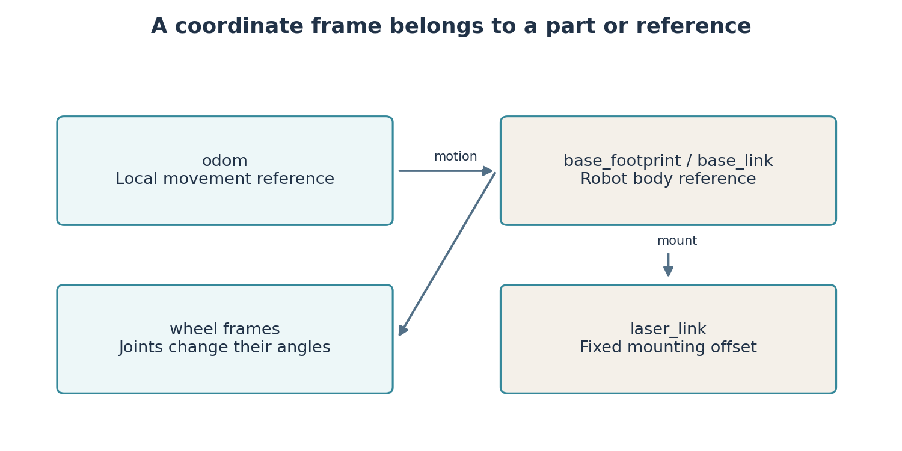
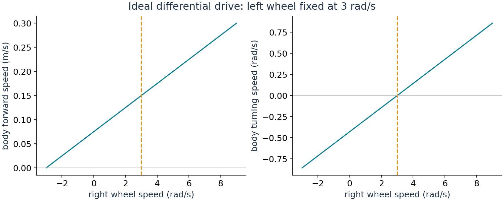

# Lab 2: Give the messages a robot, then make it move

In Lab 1, a publisher sent numbers and a subscriber used them. A robot uses the same idea, but a number now needs a physical meaning. A distance must be measured from somewhere. A velocity must refer to a direction. A program needs feedback to find out whether the robot actually moved.

**By the end, you will drive the robot in Gazebo, measure its movement through ROS, and build a movement rule in your own package.** A stationary model is the first observation, not the final outcome. Allow about 25 minutes for models and frames, 35 for simulated motion and sensors, 45 for your controller, and 15 for evidence.

## One robot, two different kinds of software

**RViz** is a viewer. It draws information that ROS nodes publish, including geometry, laser measurements and coordinate axes. **Gazebo** is a simulator. It advances a model of the world, calculates physical motion and produces simulated sensor measurements. Moving a wheel slider in RViz changes a displayed joint angle. Driving in Gazebo changes the robot's location in a simulated room.

```bash
ros2 launch arc_description display.launch.py
```

`ros2 launch` reads a launch file, which starts several programs with their settings. This launch starts a robot state publisher, a joint slider window and RViz. Move a wheel slider. The wheel rotates but the body stays in place. This is correct for the display launch. Stop it with Ctrl+C before starting Gazebo later; otherwise both launches publish descriptions and transforms for the same robot.

Open `arc_description/urdf/arc_bot.urdf.xacro`. A **link** is a rigid part, such as the body. A **joint** connects two links and says how they can move relative to each other. A wheel joint rotates. The laser mount is fixed.

**URDF**, Unified Robot Description Format, uses XML text with named tags such as `<link>`. **Xacro** adds reusable expressions and repeated structures. Processing Xacro produces URDF text; it does not start a robot. The launch supplies that text as a string using `ParameterValue(..., value_type=str)`. This avoids interpreting the XML as YAML configuration.

| Element | Meaning | Effect of a mistake |
|---|---|---|
| `visual` | Shape drawn on screen | Incorrect appearance |
| `collision` | Shape tested for contact | Incorrect interaction with walls |
| `inertial` | Mass and resistance to angular acceleration | Incorrect physical response |

As an extension, build a two-link visual model using `teaching/building/robot_workshop/urdf/student_robot.urdf` and its launch file. That small model lacks wheel control and complete physics; we drive the supplied physical model today.

## Where does a measurement begin?

A **coordinate frame** is an origin and named directions. For the body, x points forward, y left and z upward. Distances are in metres. Angles normally use radians: a full turn is $2\pi$, approximately 6.28 radians.

`base_link` belongs to the body; `laser_link` belongs to the sensor. The laser is 0.10 m ahead of the body origin and 0.12 m above it. A wall 1.00 m directly ahead of the laser is therefore 1.10 m ahead of the body origin when both frames have the same orientation.



```bash
ros2 run tf2_ros tf2_echo base_link laser_link
```

This runs a transform viewer. A **transform** describes one frame's position and orientation relative to another. `tf2` stores these relationships and follows connected paths through them. Stop the repeating output with Ctrl+C, then inspect a joint message:

```bash
ros2 topic echo /joint_states --once
```

An initial “frame does not exist” message followed by correct values can be a discovery delay. Repeated correct transforms show that the relationship became available. A fixed mount may appear at time 0.0 because its transform is static. This does not show whether simulation time is advancing.

## How two wheels move a body

The robot uses **differential drive**, two independently driven wheels. Equal wheel speeds produce straight motion in the ideal model. Unequal speeds turn the body.

Let $r$ be wheel radius, $b$ wheel separation, and $\omega_L,\omega_R$ wheel angular speeds. Wheel speed along the ground is radius multiplied by angular speed. Forward body speed is their average; turning speed depends on their difference:

$$v=\frac{r}{2}(\omega_R+\omega_L),\qquad
\omega=\frac{r}{b}(\omega_R-\omega_L).$$

Here $r=0.05$ m and $b=0.35$ m. If both wheels turn at 3 rad/s, the body moves at $0.05\times3=0.15$ m/s. A faster right wheel turns the body left, positive yaw. These equations assume rolling without slip; the physical simulation can depart from that assumption.

ROS normally requests body velocity. A `geometry_msgs/msg/Twist` message contains `linear` and `angular` vectors. We use `linear.x` for forward speed in m/s and `angular.z` for turning speed in rad/s. Other components stay zero.

## Make the robot travel through the room

Stop the display launch and start Gazebo:

```bash
ros2 launch arc_gazebo simulation.launch.py
```

The launch spawns the robot, connects its sensors to ROS and activates wheel controllers. Wait for these processes to finish starting. If the VM cannot handle the Gazebo window, use `headless:=true` with this same launch. Physics still runs. To view that running simulation in RViz, use another prepared terminal:

```bash
rviz2 -d "$(ros2 pkg prefix arc_gazebo)/share/arc_gazebo/rviz/simulation.rviz"
```

Discover the interfaces:

```bash
ros2 node list
ros2 topic list -t
ros2 control list_controllers
ros2 interface show geometry_msgs/msg/Twist
ros2 topic echo /odom --once
```

`node list` finds components. `topic list -t` gives channel names and types. Both wheel-related controllers should be active. `/odom` reports estimated local position and velocity derived from wheel motion. It is feedback, not exact world truth. Its coordinates may begin at zero although Gazebo spawns the body at world position (1,1).

In another terminal run:

```bash
ros2 run arc_course drive_distance --ros-args -p use_sim_time:=true -p distance:=0.6 -p speed:=0.15
```

The executable is `drive_distance`, in package `arc_course`. `--ros-args` introduces ROS settings; `-p` sets a named parameter. The node requests 0.15 m/s until odometry displacement reaches 0.6 m, then publishes zero. It waits for fresh odometry and a clear forward laser sector. You should see the body move and a completion message with measured displacement. Small stopping error is expected because feedback and physics arrive at finite intervals.

Commands travel through `/cmd_vel`. A relay adds the timestamp required by Jazzy's `diff_drive_controller`, which accepts `TwistStamped`. The controller calculates wheel motion, Gazebo updates the robot, and odometry returns measured movement. That is a **feedback loop**.

## Build the decision in your own node

Continue `robot_workshop` from Lab 1. Copy the supplied scaffold `teaching/building/robot_workshop/robot_workshop/drive_distance.py` into the Python module directory of your student package. Read its subscriptions and timer. Create `robot_workshop/motion_rule.py` beside it. **You write this rule**:

```python
def command_speed(travelled, target, speed):
    if travelled < target:
        return speed
    return 0.0
```

Inputs are measured displacement, requested displacement and chosen speed. The output is a forward velocity. The driver calls this only when sensor checks allow motion. Trace a timer tick: receive position, calculate displacement, evaluate your rule, place its answer in `command.linear.x`, publish.

Add this entry to the existing `console_scripts` list in your student's `setup.py`:

```python
'drive_distance = robot_workshop.drive_distance:main',
```

The left side names the command; the right side locates the module and function. Keep the Lab 1 entries. In a fresh terminal, source the ROS and course underlays, then build and run your package:

```bash
cd ~/student_ws
colcon build --symlink-install --packages-select robot_workshop
source install/local_setup.bash
ros2 run robot_workshop drive_distance --ros-args -p use_sim_time:=true -p distance:=0.4
```

Now improve the rule: multiply remaining distance by a gain, cap the result at the permitted speed, and stop within a small tolerance. This slows the approach. Compare completion time and stopping error. The driver currently decides completion from its target distance, so coordinate your tolerance with its completion condition; otherwise it can keep waiting after your rule stops the robot. This is a useful example of why two parts of a program need the same definition of “finished.”



## Read a sensor stream and preserve evidence

```bash
ros2 topic info /scan --verbose
ros2 interface show sensor_msgs/msg/LaserScan
ros2 topic echo /scan --once --qos-reliability best_effort
ros2 topic hz /scan
```

Beam $i$ points at `angle_min + i * angle_increment`. The header gives time and frame. **QoS**, quality of service, describes delivery settings. Sensor publishers often offer best effort, prioritising current data over retrying old samples. A subscriber requiring reliable delivery cannot match a best-effort publisher. Our reference subscriptions use sensor-data QoS.

`topic hz` measures the arrival rate seen by that observer. It does not certify the ranges. Face a nearby wall and then open space. If every range is stuck at the minimum, investigate sensor rendering and the VM graphics configuration before using the scan for navigation.

Record a short route for mapping:

```bash
ros2 bag record -o ~/arc_ws/bags/lab02_route /scan /odom /tf /tf_static
```

Leave the recorder running. In another terminal start the standard keyboard driver:

```bash
ros2 run teleop_twist_keyboard teleop_twist_keyboard --ros-args -p use_sim_time:=true
```

Keep that terminal focused. Its displayed key layout explains forward motion and turns; `k` requests a stop. Drive a clear route, then stop the driver and recorder with Ctrl+C. The optional `arc-drive` helper wanders automatically using gap following; it is not a keyboard driver and does not guarantee complete coverage. Choose a new name for another recording.

| File or artifact | Your responsibility |
|---|---|
| Student `motion_rule.py`, `drive_distance.py`, `setup.py` | Write the rule, understand callbacks, register the executable |
| `arc_description/urdf/arc_bot.urdf.xacro` | Inspect the supplied geometry and frames |
| `arc_gazebo/config/ros_gz_bridge.yaml` | Inspect the supplied sensor bridge |
| `~/arc_ws/bags/lab02_route` | Generated evidence; do not edit its database |
| Workspace `build`, `install`, `log` | Generated files; edit source instead |

Keep requested distance, final displacement and the effect of your change. You are ready for Lab 3 when the robot moves, odometry changes, scans are sensible and you can name their frames.

## Documentation

- [Jazzy robot_state_publisher](https://docs.ros.org/en/jazzy/p/robot_state_publisher/): URDF, joint states and transforms.
- [ROS 2 topic tutorial](https://docs.ros.org/en/jazzy/Tutorials/Beginner-CLI-Tools/Understanding-ROS2-Topics/Understanding-ROS2-Topics.html): general discovery and inspection commands.
- [Jazzy differential drive controller](https://control.ros.org/jazzy/doc/ros2_controllers/diff_drive_controller/doc/userdoc.html): velocity inputs, odometry and timeouts.
