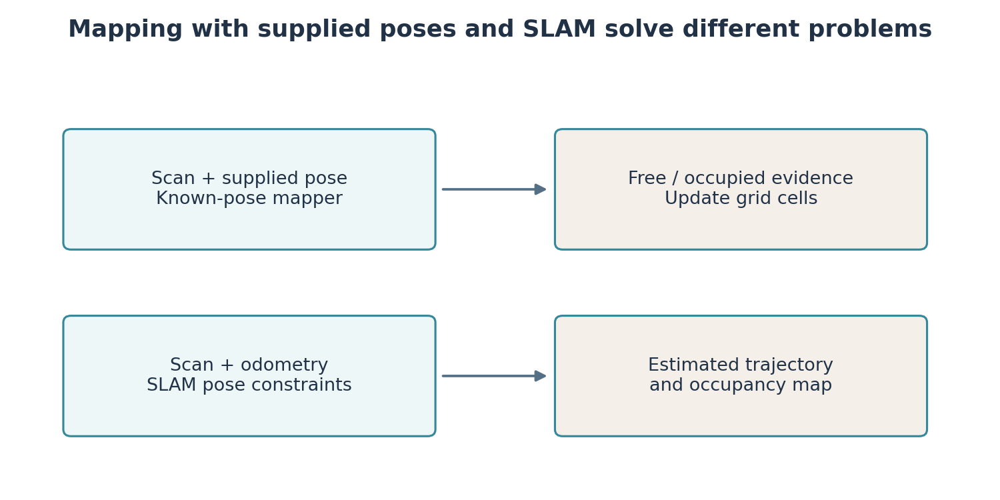
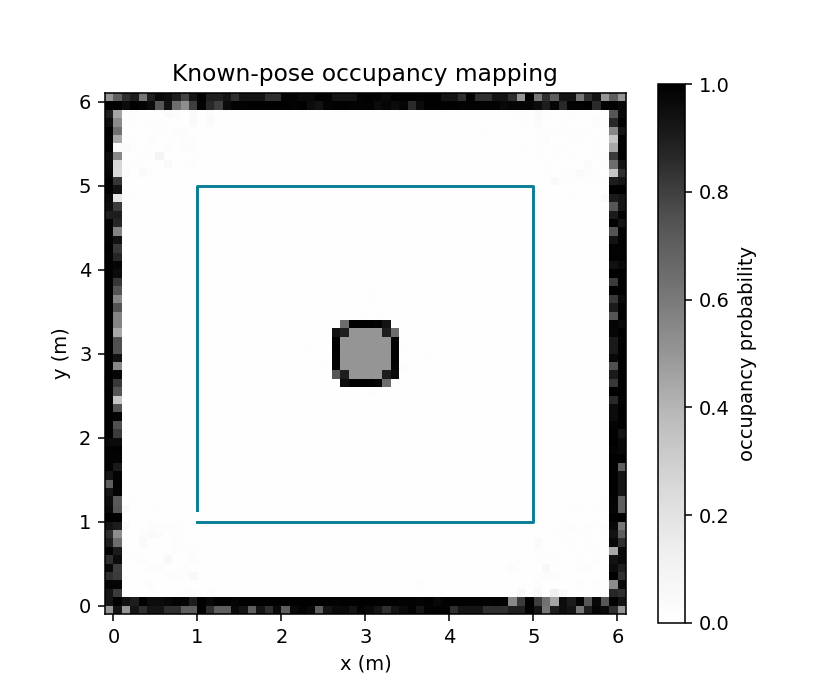

# Lab 3: Build a map, estimate the route, and save the result

The robot can move and measure distance. To navigate beyond its immediate view, it needs a representation of its surroundings. An **occupancy grid** divides space into cells and records evidence about whether each cell is occupied.

**Your result:** a map built from supplied poses, a map built while SLAM estimates the route, and a saved YAML/image pair for navigation. Spend about 40 minutes on the mapper, 50 on a SLAM route, and 30 comparing and saving evidence.

## Start with poses that we know

Suppose a robot knows its position and heading exactly and measures an obstacle 2 m ahead. Draw a ray from the sensor to the measured endpoint. Cells before that endpoint receive evidence of free space; the endpoint receives evidence of an obstacle. This is **mapping with known poses**. It does not estimate the robot's location.

```bash
python3 -m teaching.mapping_demo --out results/lab03_known_pose
```

Run this from the course repository. Open `results/lab03_known_pose/replay.html` to watch the prescribed route and `map.png` to inspect accumulated evidence. This is a numerical teaching simulation with exact pose inputs, not a Gazebo recording.

A resolution of 0.1 m means cells are 10 cm wide. A 6 m wall spans about 60 cells. Smaller cells can preserve finer detail but use more memory and do not create information the sensor never measured.



## Turn a range into a grid cell

For sensor world pose $(x_s,y_s,\theta_s)$, a range $d$ at beam angle $a$ has endpoint

$$x_e=x_s+d\cos(\theta_s+a),\qquad y_e=y_s+d\sin(\theta_s+a).$$

Cosine and sine split a distance into its x and y components. At angle zero, cosine is 1 and sine is 0: the beam extends only along x. At 90 degrees it extends along y.

Include the laser mount offset. With the sensor 0.10 m ahead of the body, $x_s=x_b+0.10\cos\theta_b$ and $y_s=y_b+0.10\sin\theta_b$. Adding 0.10 to world x regardless of heading would fail when the body turns.

Subtract the map's x origin from the endpoint x, divide by resolution and take the floor to obtain its column. Floor means the integer at or below the value. Repeat with y for the row. Our map rows increase upward in y; image files usually store their top row first. The exporter flips rows so coordinates remain consistent.

## Accumulate evidence, not certainty

Let $p$ be a cell's occupancy probability. We store **log odds**:

$$\ell=\log\frac{p}{1-p},\qquad p=\frac{1}{1+e^{-\ell}}.$$

At $p=0.5$, neither outcome is favoured and $\ell=0$. Positive values favour occupied, negative values favour free. The logarithm converts multiplication of odds into addition. With the chosen measurement model and prior of 0.5, the mapper adds 0.85 for a hit and subtracts 0.40 for a free-space observation. One hit changes probability from 0.5 to about 0.70. Repeated hits increase it further.

These increments are model choices. Repeated scans are often correlated, so independent evidence accumulation is an approximation. We clamp log odds between -5 and +5 to keep old observations from making a cell effectively impossible to change.



In `starters/lab03/occupancy.py`, `integrate_scan` calculates endpoints, `bresenham` identifies cells along a ray, and `_update_cell` adds and clamps evidence. A range at the maximum is a miss, not an occupied endpoint. Otherwise the map develops a false ring at the sensor range limit. Invalid ranges are ignored in this mapper; a controller directly commanding motion may need a stricter response.

**Build your mapper** in `starters/lab03/occupancy_skeleton.py`. Start with coordinate conversion and a horizontal ray on a tiny grid, then implement evidence updates:

```bash
ARC_OCCUPANCY=occupancy_skeleton python3 -m pytest starters/lab03/tests -q
```

The environment variable selects your exercise module. Failures before implementation are expected. Without the selector, the tests use the supplied reference. Do not change expected answers to hide an incorrect update.

## Use the moving robot's recording

```bash
python3 -m teaching.map_bag --bag ~/arc_ws/bags/lab02_route --out results/lab03_odometry
```

The bag reader associates `/scan` and `/odom` by header time and applies the sensor offset. Read `report.json`; a scan without a close odometry sample must not silently use an unrelated pose. The output includes an image, YAML metadata and a numerical log-odds array.

The mapper accepts odometry as given, so it cannot repair a wrong trajectory. Wheel slip and heading error may make a long wall thick or bent. “Known pose” here means a supplied input to the mapping algorithm, not perfect ground truth.

After your tests pass, run the same data through your implementation:

```bash
ARC_OCCUPANCY=occupancy_skeleton python3 -m teaching.map_bag --bag ~/arc_ws/bags/lab02_route --out results/lab03_student
```

## What SLAM adds

**SLAM**, simultaneous localisation and mapping, estimates where the robot travelled while building a representation of its surroundings. Odometry predicts movement. Overlapping scans supply geometric constraints. Returning to a recognisable place can add a **loop closure**, a constraint linking the current pose to an earlier pose. Optimisation can then revise the route estimate.

A loop-shaped route does not guarantee successful loop closure. The views need overlap and sufficiently distinctive geometry, and the candidate match must pass checks. A featureless corridor can make alignment ambiguous.

We use SLAM Toolbox as a working system. Its internal matcher is not the simple ICP function in Lab 4. That later exercise explains one scan-alignment method, not the entire toolbox.

Start a fresh Gazebo session using Lab 2's launch. In another prepared terminal:

```bash
ros2 launch arc_nav slam.launch.py
```

Open RViz as in Lab 2. Add Map `/map`, LaserScan `/scan` and RobotModel displays if needed. Set the fixed frame to `map` once it is available. Use the keyboard driver from Lab 2, drive slowly, keep obstacles in view and revisit the start. The body should move while the map grows.

```bash
ros2 topic info /map --verbose
ros2 run tf2_ros tf2_echo map base_footprint
ros2 param get /slam_toolbox use_sim_time
```

Stop the repeating transform command before entering the next command. The map topic includes occupancy data and metadata. The transform gives estimated robot pose in the map frame. `use_sim_time` should be true so mapping uses Gazebo's `/clock`.

If no map appears, check scans, odometry, the laser-to-base transform and clock first. A blank viewer may reflect a wrong fixed frame or unavailable data. Tuning SLAM before checking its inputs makes diagnosis harder.

## Save the map for navigation

Keep SLAM running while saving:

```bash
mkdir -p ~/arc_ws/maps
ros2 run nav2_map_server map_saver_cli -f ~/arc_ws/maps/lab03_map --ros-args -p use_sim_time:=true
```

`-f` supplies an output stem. The saver normally writes `lab03_map.yaml` and `lab03_map.pgm`. **YAML** stores named settings as `key: value` pairs with indentation. This file records the image filename, metres per pixel, origin and thresholds. **PGM** stores grayscale pixels. Keep both together; the YAML references its image.

A grid image does not contain the full SLAM pose graph. To resume mapping later, optionally save that graph as well:

```bash
ros2 service type /slam_toolbox/serialize_map
ros2 interface show slam_toolbox/srv/SerializePoseGraph
ros2 service call /slam_toolbox/serialize_map slam_toolbox/srv/SerializePoseGraph "{filename: '$HOME/arc_ws/maps/lab03_graph'}"
```

A **service** exchanges one request and one response. Discover its type, inspect the request fields, call it, then check the response and written files. The YAML/PGM pair is sufficient for saved-map navigation; graph serialization serves continued SLAM.

| You write | You inspect | Generated evidence |
|---|---|---|
| `starters/lab03/occupancy_skeleton.py` | `teaching/map_bag.py`, `arc_mapping/arc_mapping/bag_reader.py` | Log odds, image, YAML, timing report |
| Map comparison and explanation | `arc_nav/config/slam_toolbox.yaml` | Gazebo route, RViz map, saved map pair |

Compare an actual wall in the odometry map with the SLAM map. Identify a visible difference before attributing it to correction. Keep the bag and settings. Lab 4 will load the saved grid and ask how to choose and follow a route.

## Documentation and reading

- [SLAM Toolbox](https://github.com/SteveMacenski/slam_toolbox/tree/jazzy): mapping, localisation and pose-graph serialization.
- [Nav2 Map Server](https://docs.nav2.org/configuration/packages/configuring-map-server.html): grid loading, saving and publishing.
- Thrun, Burgard and Fox, *Probabilistic Robotics*, MIT Press, 2005, Chapters 9 and 10. [Book page](https://mitpress.mit.edu/9780262201629/probabilistic-robotics/).
