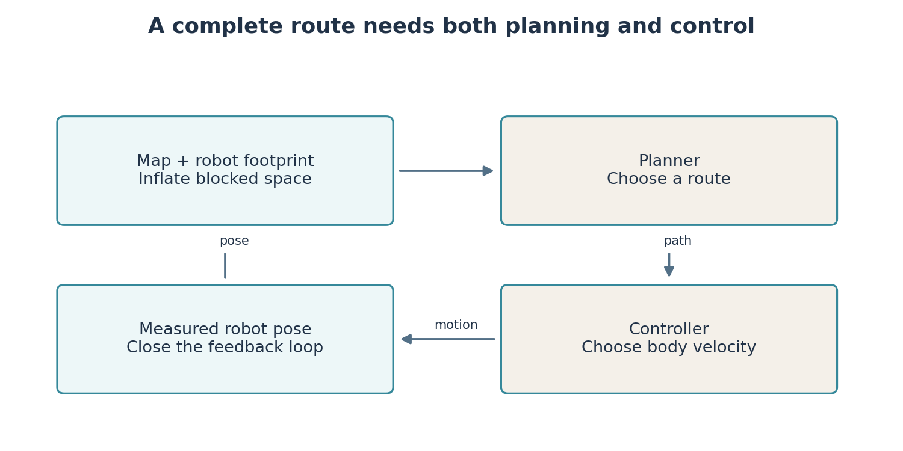
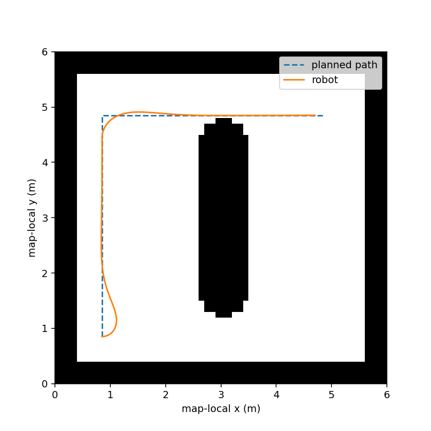

# Lab 4: Choose a route and control the robot along it

A saved map does not move the robot. We need a **planner** to choose a route and a **controller** to turn that route into velocity commands. We also need to know which cells the robot can physically occupy.

**Your result:** a moving robot replay, a comparison of search and tracking methods, and a planning run on the map saved in Lab 3. A*, PID and Pure Pursuit form the core. Theta*, follow the gap, frontier exploration and ICP are connected extensions. Implementing all of them from scratch is beyond one two-hour lab. Your week 6 coursework uses the core work from Labs 1–4; extensions are not required for completion.

## From occupancy to a navigation problem

An occupancy map describes evidence about obstacles. A planning grid describes where the robot's **centre** may go. Our robot has a radius, so a centre point cannot pass arbitrarily close to a wall. **Inflation** expands blocked cells by a chosen radius and margin. Unknown cells are blocked in this conservative experiment. This prevents a planner from treating unobserved space as confirmed free space.

The code uses `grid[row, column]`. Rows increase with map-local y; columns increase with map-local x. A cell is an index, not a position in metres. Resolution and map origin convert between these representations. Map origin can include rotation; the loader retains it, and the replay is explicitly drawn in map-local coordinates. Sending those coordinates directly as odometry goals would be incorrect without the relevant transform.



## Search means choosing which possibility to investigate next

Imagine each free cell as a location and each legal movement as a connection. Together they form a **graph**. Search maintains a **frontier**, the locations discovered but not yet fully explored. When a location is expanded, the algorithm considers its neighbours.

| Method | Which frontier item is selected? | What the guarantee depends on |
|---|---|---|
| Breadth-first search, BFS | Earliest discovered item | Fewest moves when each connection has equal cost |
| Dijkstra | Smallest cost already accumulated | Nonnegative connection costs |
| A* | Smallest accumulated cost plus estimated remaining cost | An appropriate heuristic and correct graph-search handling |
| Theta* | A* style ordering with visible shortcuts through parents | Any-angle routes; not guaranteed to be the shortest continuous path |

For A*, $g(n)$ is cost from the start to cell $n$. The heuristic $h(n)$ estimates remaining cost. The score is $f(n)=g(n)+h(n)$. On a four-connected unit grid, Manhattan distance is the absolute row difference plus absolute column difference. Moving one step can reduce it by at most one, so it does not overestimate the required number of unobstructed steps. Our closed-set implementation uses this consistent heuristic.

For start (2,2) and goal (5,6), the Manhattan estimate is $|5-2|+|6-2|=7$ steps. Obstacles may force a longer route. The heuristic guides search; it does not pretend obstacles are absent from the actual path validation.

## Watch planning become motion

From the course repository:

```bash
python3 -m teaching.navigation --algorithm astar --controller pursuit --out results/lab04_astar
python3 -m teaching.navigation --algorithm dijkstra --controller pursuit --out results/lab04_dijkstra
python3 -m teaching.navigation --algorithm bfs --controller pursuit --out results/lab04_bfs
```

Open each output folder's `replay.html`. The disk represents the robot, the line shows its actual computed trajectory, and the goal is marked. `trajectory.png` overlays planned and followed paths; `report.json` gives expanded cells, goal error and minimum footprint clearance to blocked or unknown cells. A negative clearance means the tracked trajectory entered forbidden space. These are kinematic simulations, so they omit contact dynamics and wheel slip. They are useful for isolating algorithm behaviour. Lab 5 tests a navigation stack in Gazebo.

BFS and Dijkstra should find equal-cost routes on this four-connected, unit-cost grid. A* often expands fewer cells, but the exact count depends on obstacles and tie-breaking. Compare measured results, not a claim that one algorithm always wins.

**Build A*** in `starters/lab04/planner_skeleton.py`. Maintain a priority queue, a best cost for each cell and a parent for reconstructing the route. On finding a lower cost, update both the cost and parent. Stop only when the goal is selected for expansion. The reference in `teaching/navigation.py` shows the complete algorithm after your first attempt. Use the same signature and return `(path, expanded_count)`.

```bash
ARC_SEARCH=starters.lab04.planner_skeleton python3 -m teaching.navigation --algorithm astar --out results/lab04_student
```

This selector makes the actual simulation use your function. A missing implementation raises an error instead of silently using the reference. For a blocked goal, the correct response is failure with an explanation; inventing a straight route is not a solution.

## PID: correct an error repeatedly

A path is a sequence of desired positions. The robot has its own position and heading. A controller chooses velocities from their difference. For heading control, the error $e$ is the desired angle minus the measured angle, wrapped to the interval around $-\pi$ to $\pi$. Wrapping prevents a small turn across the angle boundary from appearing to be almost a complete revolution.

$$\omega=K_Pe+K_I\sum e\,\Delta t+K_D\frac{e-e_{previous}}{\Delta t}.$$

The **proportional** term reacts to current error. The **integral** accumulates past error and can help with a persistent bias, but can grow too large when output is saturated. The **derivative** reacts to changing error and can damp motion, while also amplifying measurement noise. $\Delta t$ is the time between updates. Our implementation limits the integral and angular output and wraps angular differences before differentiation.

```bash
python3 -m teaching.navigation --algorithm astar --controller pid --out results/lab04_pid
```

This run uses the same route as the Pure Pursuit run. Compare final error, turns and trajectory. Inspect `starters/algorithms/control.py`, then implement the marked PID calculation in `starters/algorithms/control_skeleton.py`. Its tests can be selected with `ARC_CONTROL=control_skeleton`. Tune one gain at a time and preserve the previous result. A higher gain can cause overshoot or oscillation rather than simply making tracking better.

## Pure Pursuit: steer toward a point ahead

Pure Pursuit selects a point ahead on the route, expresses it in the robot's frame, and finds a circular arc toward it. Let that point be $(x_L,y_L)$, at distance $L$. The curvature is $\kappa=2y_L/L^2$, and angular velocity is $\omega=v\kappa$.

If the target is straight ahead, $y_L=0$ and the requested turn is zero. If it lies left, curvature is positive. A short lookahead can follow bends closely but respond sharply; a long lookahead smooths motion but can cut corners. Therefore a collision-free planned path does not by itself prove that a tracking controller stays collision-free. Inspect actual clearance and the robot footprint.

Our classroom controller demonstrates the geometry. Nav2's Regulated Pure Pursuit includes further speed regulation, collision projection and path handling; it is not identical to this small function.



## Load your saved map

The same planner accepts a trinary map YAML from Lab 3:

```bash
python3 -m teaching.inspect_map --map ~/arc_ws/maps/lab03_map.yaml --out results/lab04_map_view
```

Open `grid.png`, whose axes show row and column indices. Select start and goal in connected, inflated free space. The following numbers are an example, not universal coordinates; replace them with indices from your own map:

```bash
python3 -m teaching.navigation --map ~/arc_ws/maps/lab03_map.yaml --start 40 40 --goal 80 80 --algorithm astar --out results/lab04_saved_map
```

The loader reads the image path relative to its YAML, interprets thresholds and flips image rows. If the selected cell is unknown, occupied or inside the inflation margin, it rejects the request. A map's row count depends on your route and resolution, so copying another student's indices can fail legitimately.

## Connected extensions: what each method contributes

**Theta*** changes planning. It asks whether a cell can connect directly to an earlier parent with a clear line of sight, allowing a path that is not restricted to grid headings. Our line test rejects contact with occupied cell edges and corners:

```bash
python3 -m teaching.navigation --algorithm theta --out results/lab04_theta
```

**Follow the gap** is reactive. It uses current laser ranges to choose an open direction, without constructing a global route. Run the existing baseline in the robot environment:

```bash
python3 -m teaching.rollout --policy gap --seeds 500 --out results/lab04_gap
```

Inspect `replay_500.html` and its outcome. Open space now may lead to a dead end later. This is why reactive obstacle avoidance and global planning solve different problems.

**Frontier exploration** chooses where to gather new information. A frontier lies at the boundary between known free and unknown space. `reachable_frontiers` returns reachable free boundary cells in BFS order; it does not ask the robot to jump into an unknown cell. A complete explorer must group candidates, choose goals, execute a planner/controller, update the map and recover from failed goals.

**ICP**, iterative closest point, estimates a local transform between overlapping point sets. Repeatedly associate nearby points, calculate the rigid rotation/translation that reduces squared error, and update the alignment. It needs a good initial estimate and overlap. It can converge to the wrong alignment in repetitive geometry. It does not by itself solve SLAM or navigation.

```bash
python3 -m teaching.extensions --out results/lab04_extensions
```

The plot shows reachable frontiers and a synthetic ICP alignment. The report records residual error. Change the initial displacement enough to lose overlap and observe the failure. This is a local alignment experiment, not a claim of full autonomous exploration.

## Finish the first coursework investigation

Keep your A* implementation, mapper, motion rule, saved map, command evidence and one controlled comparison of tracking methods. Explain an observed failure and the change that addresses its cause. Submit in **week 6** according to the module's assessment arrangements. Nav2 and RL are not prerequisites for this submission.

## Reading

- Coulter, *Implementation of the Pure Pursuit Path Tracking Algorithm*, CMU, 1992. [Report](https://www.ri.cmu.edu/publications/implementation-of-the-pure-pursuit-path-tracking-algorithm/).
- Nash et al., *Theta*: Any-Angle Path Planning on Grids*, 2007. [Paper](https://idm-lab.org/bib/abstracts/papers/aaai07a.pdf).
- Yamauchi, *A Frontier-Based Approach for Autonomous Exploration*, 1997. [Paper](https://www.cs.cmu.edu/~motionplanning/papers/sbp_papers/integrated1/yamauchi_frontiers.pdf).
- [Nav2 Regulated Pure Pursuit](https://docs.nav2.org/jazzy/configuration_and_development/configuration_guide/controller_plugins/configuring_regulated_pp/) describes the additional checks in a deployed navigation controller.
