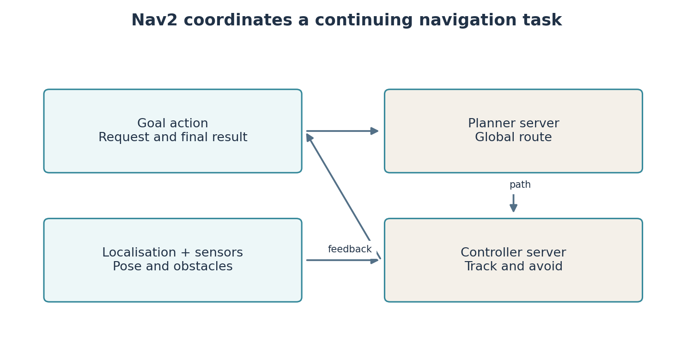
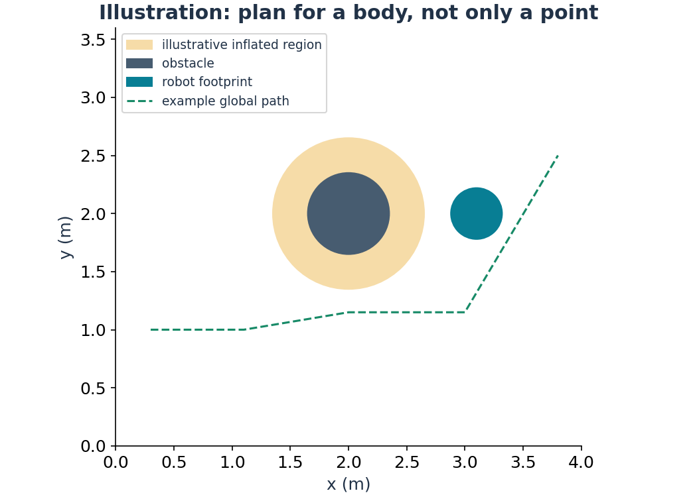

# Lab 5: Assemble navigation with Nav2

You have built parts of navigation separately. **Nav2** brings localisation, planning, control and recovery together as cooperating ROS 2 components. Studying it now gives you a practical baseline before reinforcement learning. You can later ask whether a learned controller improves a measured outcome under matched conditions.

**Your result:** the Gazebo robot reaches a chosen goal on your saved map, while you observe the plan, local control and action result. You also construct a navigation goal in your own ROS package. This lab is not needed for the week 6 coursework based on Labs 1–4.

## What must be known before planning?

The map says where obstacles are in the `map` frame. Wheel odometry estimates local movement in `odom`. **Localisation** estimates the relationship between the robot and the saved map. Nav2 commonly uses AMCL, adaptive Monte Carlo localisation: many candidate poses, called particles, are predicted using motion and weighted using agreement with laser measurements. It estimates pose in an existing map; it does not create that map.

The transform chain is `map` to `odom` to `base_footprint` to robot parts. Odometry supplies locally continuous motion. Localisation supplies a correction relative to the map. A correction can change as new evidence arrives. The initial pose you provide is a starting estimate, not a command to teleport the robot.



## Bring the saved map into the running world

Stop the SLAM launch from Lab 3 before starting saved-map navigation. SLAM and AMCL must not both publish competing `map` to `odom` transforms. Start a fresh Gazebo warehouse using Lab 2's launch. Then:

```bash
ros2 launch arc_nav navigation.launch.py map:=$HOME/arc_ws/maps/lab03_map.yaml params:=dwb
```

`map:=` supplies your saved map metadata. `params:=dwb` selects the supplied Dynamic Window Based controller configuration. The launch opens RViz and starts Nav2 with simulation time. Wait for lifecycle nodes to activate. A **lifecycle node** has managed states, such as unconfigured, inactive and active, so components can initialise in an orderly way.

In RViz, select **2D Pose Estimate**, click the robot's approximate location on the saved map and drag an arrow in its actual heading direction. Match visible walls and laser returns. Do not assume (1,1) in Gazebo world coordinates must also be (1,1) in the saved map; map origin and SLAM pose convention matter.

Choose a nearby reachable free goal using **Nav2 Goal**. The robot should turn and travel toward it. Observe the global path and local obstacle information. A goal inside a wall or disconnected region should fail, not make the robot drive through the wall.

## Inspect the job while it is happening

```bash
ros2 action list -t
ros2 action info /navigate_to_pose
ros2 interface show nav2_msgs/action/NavigateToPose
ros2 lifecycle get /planner_server
ros2 topic echo /amcl_pose --once
```

An **action** is a job with acceptance, feedback and a final result, and it can support cancellation. It suits navigation because reaching a goal takes time. Acceptance only means the server agreed to attempt the task. The eventual result can still report failure.

A topic suits repeated values such as scans. A service suits a short request/response, such as saving a map. An action suits a continuing task such as navigation. These patterns are reusable in your own projects.

## Construct your own goal

Use `teaching/building/robot_workshop/robot_workshop/send_goal.py` as the scaffold for a node in your student package. Read the action client creation, server wait, goal construction, feedback callback and result callback. Register its `send_goal` entry in your student's `setup.py`, rebuild and source the overlay as in Lab 2.

**You write the goal construction and interpretation.** A `PoseStamped` needs a frame, timestamp, position and orientation. Use `map` because the selected target belongs to the saved map. In planar navigation a yaw angle $\theta$ can be represented by quaternion components $z=\sin(\theta/2)$ and $w=\cos(\theta/2)$, with x and y zero. For a zero heading, z is zero and w is one. An all-zero quaternion is not a valid rotation.

Inspect the scaffold's declared parameters before running it. Replace the example target with a free map location you have checked in RViz:

```bash
ros2 run robot_workshop send_goal --ros-args -p use_sim_time:=true -p x:=2.0 -p y:=2.0 -p yaw:=0.0
```

The client sends a request to an existing navigation system; it does not implement path planning itself. Identify the point where the result status becomes available. Log acceptance separately from success. As an extension, add a cancellation path after a chosen time and confirm that the server acknowledges cancellation.

## Why the robot can change its route

The global planner chooses a route through a global costmap. A **costmap** stores navigation costs, including obstacle and inflation information. The controller considers current pose, path and nearby obstacles to request velocity. DWB samples candidate velocities and scores predicted trajectories. MPPI uses sampled control sequences in a model-predictive optimisation scheme. Both require appropriate robot limits and cost settings; neither guarantees success in every environment.

The supplied second configuration can be selected with `params:=mppi` after stopping the first navigation launch. Repeat the same start, goal and world. Change one setting at a time. Record time to goal, route shape and outcome. A shorter time is not an improvement if it also produces unacceptable clearance.



Recovery behaviours can clear stale costmap information or attempt a controlled manoeuvre when progress stops. They cannot repair a missing laser topic or an incorrect transform. Treat recovery as part of the task logic, not a substitute for diagnosing bad inputs.

## Add a short diagnostic service

The optional scaffold `teaching/building/robot_workshop/robot_workshop/scan_service.py` provides `/check_scan`. It illustrates a request/response interface. Read its age and validity checks, then run the registered executable and inspect the service:

```bash
ros2 run robot_workshop scan_service --ros-args -p use_sim_time:=true
```

In another terminal:

```bash
ros2 service call /check_scan std_srvs/srv/Trigger '{}'
```

The empty braces mean the request has no fields. A successful transport call does not automatically mean the diagnostic result is positive; read the response's success flag and message.

## Evidence and file ownership

| Student work | Supplied implementation | Generated artifacts |
|---|---|---|
| Goal construction and result handling in your `send_goal.py` | `arc_nav/launch/navigation.launch.py` | Navigation logs and recordings |
| One explained configuration experiment | `arc_nav/config/nav2_dwb.yaml`, `arc_nav/config/nav2_mppi.yaml` | A comparison table with matched conditions |
| Optional scan service or particle-filter exercise | `starters/lab05/particle_filter.py` | Diagnostic outputs |

Keep a successful run and one explained failure. Do not grade success from a screenshot of a path alone: a path can exist while the controller fails to reach its goal. Save the action result and the observed motion.

## Documentation

- [Nav2 Jazzy setup guide](https://docs.nav2.org/jazzy/configuration_and_development/first_time_robot_setup_guide/): transforms, odometry, sensors and navigation components.
- [Nav2 navigation actions](https://api.nav2.org/jazzy/actions/navigation/): goal, feedback and result interfaces.
- [Nav2 Simple Commander](https://api.nav2.org/nav2-jazzy/html/md_nav2_simple_commander_README.html): an application-level interface to the same navigation system.
