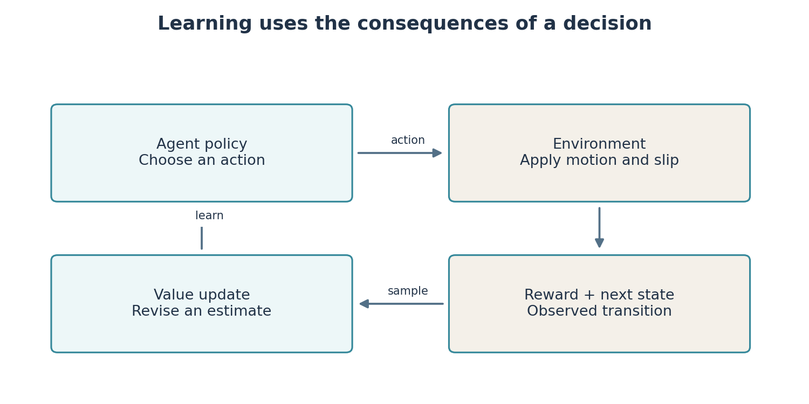
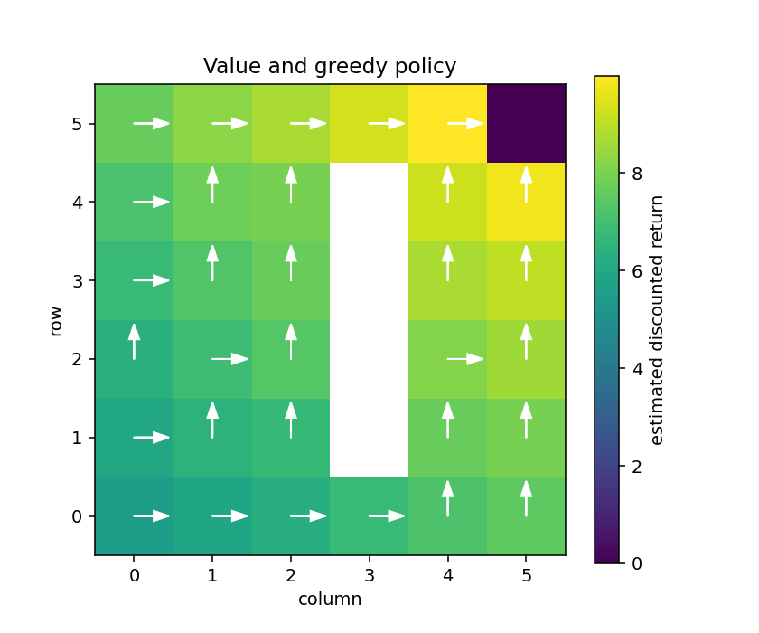

# Lab 6: Learn a navigation decision from experience

So far, you have written rules and supplied a map. **Reinforcement learning**, RL, asks a different question: can a decision rule improve through interaction and feedback? We start with a small grid robot so every number can be inspected. Neural networks are not needed yet.

**Your result:** a moving grid-robot replay, a table learned from experience and a comparison with a solution calculated from a known model. This lab introduces the concepts while you implement an update. It does not ask you to memorise algorithm names before seeing what they do.

## Describe one decision completely

The **agent** is the decision-making program. The **environment** is the world responding to its actions. At each step the agent observes the situation, chooses an action, receives a numerical reward, and sees what happened next. An **episode** is one complete attempt, ending at the goal or a chosen limit.

| Concept | In this lab | Later in the ROS robot |
|---|---|---|
| State | Grid cell occupied by the robot | Full physical state, generally not directly available |
| Observation | The same cell index | Laser measurements, relative goal and measured velocity |
| Action | East, north, west or south | A velocity choice or a pair of continuous commands |
| Reward | Goal reward minus movement/collision penalties | A numerical rule based on progress and outcomes |
| Policy | Which action to choose in each cell | A function from observations to commands |
| Transition | Probability of reaching another cell after an action | Motion, sensing and disturbances |

In a **Markov decision process**, the state contains enough information to predict the distribution of the next state and reward given the action. Our grid cell has this property under the defined model. One laser scan on a moving robot often does not: hidden obstacles, moving people and unobserved velocity can matter. That is partial observability. We will distinguish the physical state from the limited observation supplied to a learned policy.

The grid robot usually moves in the requested direction, but sometimes slips sideways. The code's `slip=0.1` means a total 10% probability of a perpendicular action, split equally between the two sides. A blocked movement leaves the robot in its current cell and gives a penalty. Reaching the goal ends the task.



## Why immediate reward is not enough

Moving toward the goal can require a detour. We therefore consider **return**, the sum of future rewards. With discount factor $\gamma$:

$$G_t=r_{t+1}+\gamma r_{t+2}+\gamma^2r_{t+3}+\cdots.$$

The subscript $t$ means the current decision time. A factor below one gives less weight to distant rewards. With rewards 1 now and 2 on the next step and $\gamma=0.9$, the return is $1+0.9\times2=2.8$. Discounting is part of the learning objective; it is not a measure of confidence in a sensor.

The **value** $V(s)$ is expected future return from a state under a specified policy. **Action value** $Q(s,a)$ is expected return after choosing action $a$ in state $s$ and then following the policy. Expected means an average over possible outcomes, including slips.

## Solve the small problem when the model is available

Dynamic programming uses the transition model directly. **Value iteration** repeatedly asks, for every state, which action has the largest expected immediate reward plus discounted next-state value. **Policy iteration** alternates two tasks: evaluate the current policy, then improve its action choices using those values.

```bash
python3 -m teaching.tabular --method value --out results/lab06_value
python3 -m teaching.tabular --method policy --out results/lab06_policy
```

Open `replay.html` and `policy.png` in each folder. The arrows show greedy actions; colour shows estimated value. Both methods use the same known model. Equal-valued alternatives may give different arrows while achieving the same value. Inspect `GridRobot.transitions`, `action_values`, `value_iteration` and `policy_iteration` in `teaching/tabular.py`.

These methods are useful here as a reference answer. Calling them model-free learning would be incorrect because they explicitly use transition probabilities.

## Learn when only sampled experience is available

**Q-learning** updates a table after observing one transition:

$$Q(s,a)\leftarrow Q(s,a)+\alpha\left[y-Q(s,a)\right],$$
$$y=r+\gamma(1-d)\max_{a'}Q(s',a').$$

Here $s'$ is the next state; $a'$ ranges over its possible actions; $d$ is 1 for a true terminal transition and 0 otherwise. The target $y$ combines observed reward and an estimate of future return. The difference $y-Q(s,a)$ is the **temporal-difference error**. The learning rate $\alpha$ controls how much of that difference is applied now.

For current value 2, reward 1, best next value 4, $\gamma=0.9$ and $\alpha=0.2$, the nonterminal target is 4.6 and the updated entry is $2+0.2(4.6-2)=2.52$. If the transition ends the task, the target is just 1 and the updated entry is 1.8. A terminal goal has no later decision from which to collect another reward.

**You write** `q_update` in `starters/lab06/q_update_skeleton.py`. Update exactly the selected table entry in place and return the target. Then make the running experiment use your code:

```bash
ARC_TABULAR=starters.lab06.q_update_skeleton python3 -m teaching.tabular --method q --episodes 3000 --out results/lab06_student
```

To compare with the supplied reference, run without the selector:

```bash
python3 -m teaching.tabular --method q --episodes 3000 --seed 0 --out results/lab06_q
```

This produces `q.npy`, `policy.npy`, `returns.csv`, a learning plot and a replay. NumPy's `.npy` files store arrays; they are generated results, not source files to edit by hand.

## Learning needs exploration

If the agent always chooses its currently highest-valued action, an early mistake can prevent it from discovering a better route. **Epsilon-greedy exploration** chooses a random action with probability $\epsilon$, otherwise the largest current Q value. The code reduces epsilon during training but keeps a small exploratory probability.

Q-learning is **off-policy**: its update targets the greedy next action even while the behaviour used to collect experience is exploratory. This differs from evaluating the exact exploratory behaviour policy.

Evaluation uses greedy actions and a separate random-number stream for slips. Do not compare a noisy training return directly with deterministic policy quality. Repeat complete training runs with different seeds to assess variation. More episodes may help, but one successful seed does not establish general reliability.



## A time limit is not always a terminal state

The Q-learning collector stops an attempt after 150 steps to avoid an endless training loop. Here that is an external collection limit. The underlying navigation task could continue, so the final stored transition still bootstraps from its next state. A true goal transition does not bootstrap.

Gymnasium later represents this distinction as `terminated` and `truncated`. If a finite deadline is part of the task itself, it belongs in the problem definition, and remaining time may need to be included in the state. Do not blindly set every “episode ended” flag to terminal.

## Connect this to robot software

RL does not replace ROS messages. ROS carries observations into a policy and carries chosen commands out. In Lab 6 we isolate learning from sensor transport so you can inspect each table entry. Lab 7 introduces continuous robot observations, and Lab 9 connects policies to live ROS topics. Do not publish grid actions as `Twist` values; “north” is a grid transition, not a body-frame wheel command.

Your investigation is to vary slip or the movement penalty, retrain, and explain the resulting policy using the objective. A reward is a design choice, not an automatic definition of good behaviour. A robot can earn reward in an unintended way, so report goal completion and failed attempts separately from return.

## Files and reading

| File | Role |
|---|---|
| `starters/lab06/q_update_skeleton.py` | Your update implementation |
| `teaching/tabular.py` | Environment, reference algorithms and experiment driver |
| `results/lab06_q` | Generated tables, curves, replay and evaluation report |

- Sutton and Barto, *Reinforcement Learning: An Introduction*, second edition, Chapters 3, 4 and 6. [Author's book page](https://incompleteideas.net/book/the-book-2nd.html).
- [Gymnasium: handling time limits](https://gymnasium.farama.org/main/tutorials/handling_time_limits/) explains why terminal transitions and external truncations need different targets.
