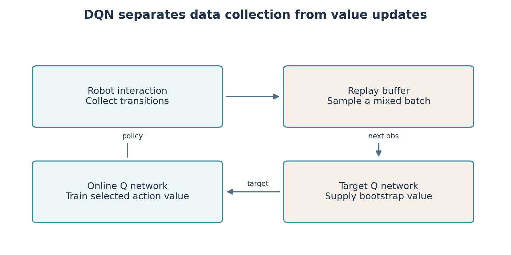
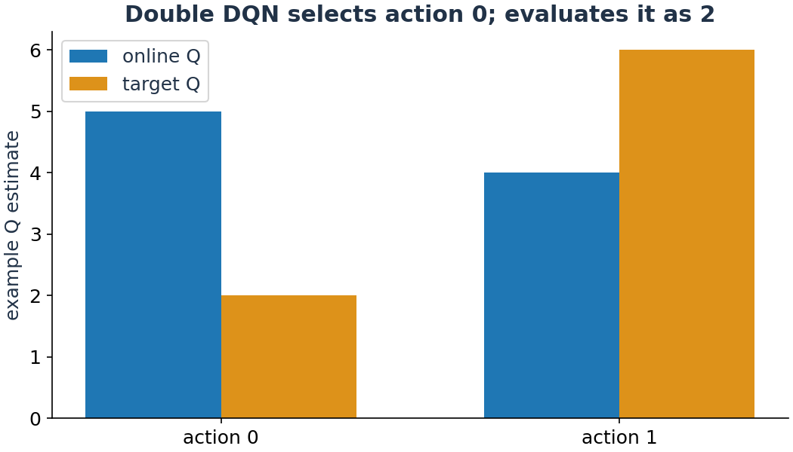

# Lab 7: Replace the table with a neural action-value function

The grid table works because there are few states. A robot's laser distances and velocity are continuous. Listing a separate table row for every possible observation is impractical. **DQN**, deep Q-network, uses a neural network to approximate action values from an observation.

**Your result:** implement DQN and Double DQN targets, train a checkpoint, and watch its robot trajectory on layouts excluded from training. A checkpoint that loads correctly is not automatically a useful navigation policy.

## Keep the learning question recognisable

The observation has 29 numbers: 24 laser ranges, distance to the goal, sine and cosine of the relative goal angle, forward velocity and angular velocity. Ranges and distance are scaled to known limits. Sine and cosine avoid a jump between angles just below positive pi and just above negative pi. The sensor origin is 0.10 m ahead of the body, matching the supplied model.

The observation is still incomplete information about the world. It does not contain a full map or the intentions of moving obstacles. A feed-forward policy may fail when memory is needed. That limitation should inform interpretation of the experiment.

DQN selects from a **finite action set**. Our six choices are forward, forward-left, forward-right, turn-left, turn-right and slow reverse. `teaching/deep_q.py` stores their normalised velocity pairs in `ACTIONS`. `scale_action` converts a normalised forward value of 0.6 to 0.30 m/s, and a turn value of 0.5 to 0.90 rad/s. DQN does not directly optimise an unrestricted continuous action in this lab.

## What the network predicts

The network receives one 29-number observation and returns six Q estimates, one per action. The largest output determines the greedy choice. Hidden layers combine input features through learned weights and nonlinear functions. These outputs estimate return; they are not probabilities and need not sum to one.

Training changes weights to reduce a prediction error. A **gradient** describes how changing a weight changes the loss. The optimiser adjusts weights in a direction intended to reduce it. Neural approximation allows generalisation between observations but introduces errors and instability that a small exact table did not have.



## Why there are two networks and a replay buffer

A **replay buffer** stores transitions: observation, action, reward, next observation and terminal flag. Sampling a batch mixes experiences from different moments and reuses data. This reduces immediate temporal correlation in updates, although it does not make all samples independent.

The **online network** is updated by gradient descent. The **target network** is copied from it less frequently and supplies temporarily more stable targets. Our implementation copies every 1,000 environment steps and begins updates after 256 transitions. Read these constants before changing them.

The DQN target is

$$y=r+\gamma(1-d)\max_a Q_{target}(o',a).$$

`o'` is the next observation and `d` is true task termination. The network prediction being trained is $Q_{online}(o,a)$ for the action actually taken. A Huber loss penalises their difference, with less sensitivity to very large errors than squared loss. Target calculation is performed without gradient tracking; otherwise the optimiser can change both sides of the target unintentionally.

## Double DQN: selection and evaluation are different operations

Taking a maximum over noisy value estimates can create overestimation. **Double DQN** selects the action using the online network and evaluates that selected action using the target network:

$$a^*=\operatorname{argmax}_a Q_{online}(o',a),\qquad
y=r+\gamma(1-d)Q_{target}(o',a^*).$$

`argmax` returns an action index. `max` returns a value. If online values are `[5,4]` and target values are `[2,6]`, Double DQN selects action 0 and uses target value 2. Ordinary DQN uses target maximum 6. This is Double DQN, a neural-network adaptation of the double-estimation idea; it is not the same implementation as tabular Double Q-learning.

**You implement** `td_targets` in `starters/lab07/targets_skeleton.py`. Return one target for each row in the batch. Apply the terminal mask after obtaining the chosen next value. The provided driver keeps replay, optimisation and environment interaction visible in one module.

```bash
ARC_DQN_TARGET=starters.lab07.targets_skeleton python3 -m teaching.deep_q --method double --steps 5000 --out results/lab07_student
```

The first 5,000 steps are a development run. They exercise the update but are not a promised training budget for reliable navigation. Compare reference runs under equal budgets:

```bash
python3 -m teaching.deep_q --method dqn --steps 50000 --seed 0 --out results/lab07_dqn
python3 -m teaching.deep_q --method double --steps 50000 --seed 0 --out results/lab07_double
```

## Watch the policy and measure what it does

```bash
python3 -m teaching.rollout --policy dqn --model results/lab07_double/policy.pt --seeds 500 501 502 --out results/lab07_validation
```

Open the generated `replay_500.html` and trajectory plots. `episodes.csv` records outcomes and `summary.json` counts collision-free successes, collisions and timeouts. Use the same layouts to evaluate the gap-following baseline from Lab 4. `policy.pt` is a PyTorch checkpoint; `loss.csv` is optimisation history. A decreasing training loss is not proof that the robot reaches goals.

Training uses geometry seeds 0–99. Validation uses 500–509 to help choose settings. Final test layouts 1000–1009 stay unused until those choices are frozen. A random seed controls a pseudorandom sequence; changing only sensor noise in the same layout would not test generalisation to new geometry.



## Diagnose a learned failure

If the robot spins, reverses indefinitely or stops near obstacles, trace observation, action and reward together. Check action scaling before changing the network. Compare epsilon during collection with greedy evaluation. Confirm that terminal transitions do not bootstrap and external time limits do. Then compare several independent training seeds.

The environment is a fast kinematic simulator. It omits wheel acceleration and contact physics, so success here does not establish Gazebo performance. Lab 9 tests the ROS interface and this transfer gap explicitly. Save model metadata with weights so action order and observation layout remain recoverable.

## Files and reading

| Student code | Reference and integration | Generated files |
|---|---|---|
| `starters/lab07/targets_skeleton.py` | `teaching/deep_q.py`, `arc_rl/nav_core.py` | `policy.pt`, losses, episode returns, evaluation replays |

- Mnih et al., *Human-level control through deep reinforcement learning*, 2015. [Paper](https://www.nature.com/articles/nature14236).
- van Hasselt, Guez and Silver, *Deep Reinforcement Learning with Double Q-learning*, 2016. [Author manuscript](https://arxiv.org/abs/1509.06461).
- [PyTorch DQN tutorial](https://docs.pytorch.org/tutorials/intermediate/reinforcement_q_learning.html) provides another view of replay, targets and gradient updates.
