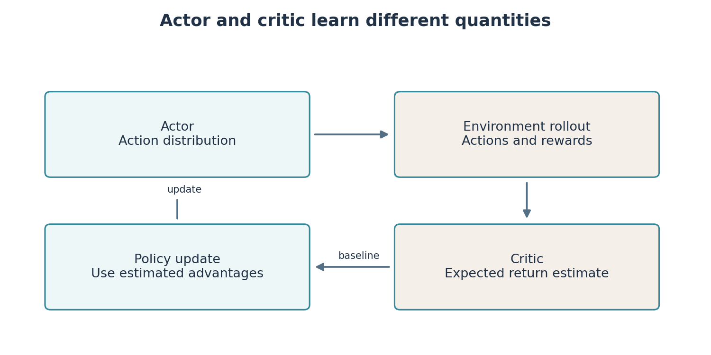
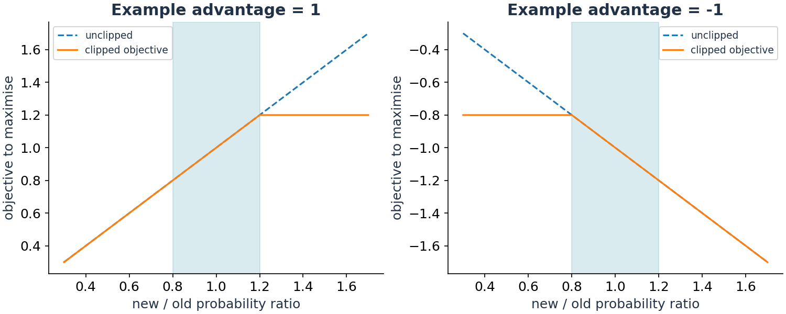

# Lab 8: Learn the policy directly, then train continuous control

DQN estimates a value for each discrete action. A **policy-gradient** method instead adjusts the parameters of the action-selection rule itself. We first make that idea visible with REINFORCE on the grid robot, then use PPO for the continuous velocity interface of our navigation robot.

**Your result:** implement discounted returns, run a direct policy update, train a PPO checkpoint and inspect its moving robot replay. You should be able to explain what the actor, critic, advantage and clipping term contribute before changing a hyperparameter.

## A policy can represent probabilities

On the grid, a policy can assign probabilities to the four actions. At one cell it might choose east with probability 0.6, north with 0.2, west with 0.1 and south with 0.1. Training changes these probabilities based on experience. The sampled action still determines one actual move.

The implementation stores unconstrained numbers called **logits**. A categorical distribution converts them into probabilities that are nonnegative and sum to one. Logits themselves are not probabilities. Sampling from the distribution allows exploration without a separate epsilon-greedy switch.

## REINFORCE: increase the likelihood of useful actions

After collecting an episode, calculate the discounted future return from each decision. For rewards `[1, 2, 3]` and $\gamma=0.9$, the last return is 3, the previous return is $2+0.9\times3=4.7$, and the first is $1+0.9\times4.7=5.23$.

**You implement** `discounted_returns` in `starters/lab08/returns_skeleton.py`. Work backward, repeatedly applying `value = reward + gamma * value`, then restore chronological order. This is simpler and more efficient than recomputing every suffix sum independently.

The REINFORCE update increases the log probability of sampled actions in proportion to their return. In code, a minimised loss uses a minus sign:

$$L=-\sum_t\gamma^t\log\pi_\theta(a_t\mid s_t)G_t.$$

The symbol $\theta$ denotes learned parameters, not the robot heading here. $\pi_\theta(a\mid s)$ is the policy's probability of action $a$ at state $s$. The log probability provides a useful derivative. The factor $\gamma^t$ corresponds to the discounted start-state objective used by this example. Return is treated as observed data during the gradient calculation.

```bash
ARC_RETURN=starters.lab08.returns_skeleton python3 -m teaching.policy_gradient --episodes 1000 --out results/lab08_student
python3 -m teaching.policy_gradient --episodes 3000 --seed 0 --out results/lab08_reinforce
```

The reference experiment writes a greedy policy and training returns. Its grid task ends after at most 150 decisions, so that finite horizon is part of this demonstration's objective. This differs from Lab 7's external collection cutoff. Do not assume every algorithm's episode limit has the same meaning.

## Why add a critic?

An action can receive a high return simply because it was taken in an easy state. To compare actions more meaningfully, estimate how much better the observed return was than expected at that state.

A **critic** estimates state value $V(s)$. An **actor** supplies the policy. Their difference can form an **advantage** estimate, for example $A_t=G_t-V(s_t)$. If return is 8 and the critic expected 6, the estimated advantage is +2. Positive advantage encourages the sampled action; negative advantage discourages it relative to alternatives.

Subtracting an action-independent baseline can reduce policy-gradient variance without changing the expected gradient under the usual conditions. A learned critic can still be inaccurate. Actor-critic methods therefore train both a policy and a value function. They are not “two agents competing.”

**Generalised advantage estimation**, GAE, combines short and longer temporal-difference estimates using a parameter $\lambda$. Shorter estimates rely more on the critic and can have bias; longer estimates can have more variance. PPO uses this machinery in our implementation. You do not need to derive GAE to run the experiment, but you should identify its role and avoid calling the critic's estimate ground truth.



## PPO limits an update's incentive to move too far

**Proximal Policy Optimisation**, PPO, collects a rollout with a policy, calculates advantages and then updates using that batch. It compares the probability of the sampled action under the new and old policies:

$$r_t(\theta)=\frac{\pi_\theta(a_t\mid o_t)}{\pi_{old}(a_t\mid o_t)}.$$

For continuous actions this is a ratio of probability densities. If the sampled action was twice as likely under the new policy, the ratio is 2. PPO's clipped objective compares $r_tA_t$ with a version whose ratio is clipped near 1, typically between 0.8 and 1.2. This reduces the incentive for some excessively large changes. It is not a hard safety constraint and does not guarantee monotonic performance improvement.

Unlike DQN's large replay buffer, PPO normally collects fresh on-policy rollouts for successive updates. Reusing arbitrary old DQN replay samples inside the standard PPO objective would violate its assumptions about the behaviour policy.

## Train the same navigation interface with continuous actions

PPO here receives the same 29-number observation as DQN but outputs a two-component normalised action. Positive forward commands scale up to 0.50 m/s, reverse down to -0.125 m/s, and turning to ±1.80 rad/s. A stochastic action distribution provides exploration during training. Evaluation uses the deterministic prediction.

```bash
python3 -m teaching.train_policy --reward dense_progress --steps 200000 --seed 0 --name lab08_dense
```

`--steps` is a requested environment-interaction budget. The vectorised implementation collects full batches, so its actual step count can exceed that request; metadata records the actual value. The command uses four small environments and CPU inference. Runtime depends on the teaching machine. Use a smaller budget to check the program, then a measured budget for an actual learning comparison.

The reward combines signed progress, a small time cost, proximity and turning terms, plus goal/collision outcomes. These terms encourage behaviour but do not mathematically guarantee safety or optimal routes. Read `reward_dense_progress` in `arc_rl/nav_core.py`; calculate the reward for one concrete step before changing coefficients.

```bash
python3 -m teaching.rollout --policy ppo --model models/lab08_dense.zip --seeds 500 501 502 --out results/lab08_validation
```

Open `replay_500.html`, the trajectory plots and `summary.json`. A training curve measures reward under the learning process. The evaluation table measures what the frozen policy does under specified conditions. Both matter.



## Make one controlled comparison

Train a second reward design using `--reward sparse_safe` and a new model name. Despite its name, this reward still includes time and proximity terms; it is not purely terminal-only reward. Keep architecture, seeds and interaction budget matched. Alternatively enable `--domain-randomisation`, which in this code varies laser-noise standard deviation only. It does not randomise mass, friction or latency.

Compare several seeds and report successes, collisions and timeouts. A reward change can increase return while reducing success, especially if the numerical reward scales differ. Returns from different reward definitions are not directly comparable performance scores.

## How this develops the earlier RL material

The old dynamic-programming and Q-learning material becomes Lab 6. DQN and Double DQN become Lab 7. REINFORCE, actor-critic ideas and PPO form this lab. This sequence keeps the conceptual dependency clear: return and value first, function approximation next, direct policy optimisation afterward.

Particle swarm optimisation is a population-based optimiser, not a prerequisite for RL. It can be an optional hyperparameter-search project. Multi-agent RL adds interactions between learners and possible nonstationarity; it is also a later extension. We do not compress those separate topics into a beginner's first PPO experiment.

## Files and reading

| You write or change | Supplied implementation | Generated evidence |
|---|---|---|
| `starters/lab08/returns_skeleton.py` | `teaching/policy_gradient.py` | Grid policy and returns |
| One justified reward or training setting | `teaching/train_policy.py`, `arc_rl/nav_core.py` | Model ZIP, metadata, monitor logs and robot replays |

- Sutton and Barto, second edition, Chapter 13: policy-gradient methods. [Book](https://incompleteideas.net/book/the-book-2nd.html).
- Schulman et al., *Proximal Policy Optimization Algorithms*, 2017. [Paper](https://arxiv.org/abs/1707.06347).
- [Stable-Baselines3 PPO documentation](https://stable-baselines3.readthedocs.io/en/master/modules/ppo.html): implementation parameters and supported action spaces.
