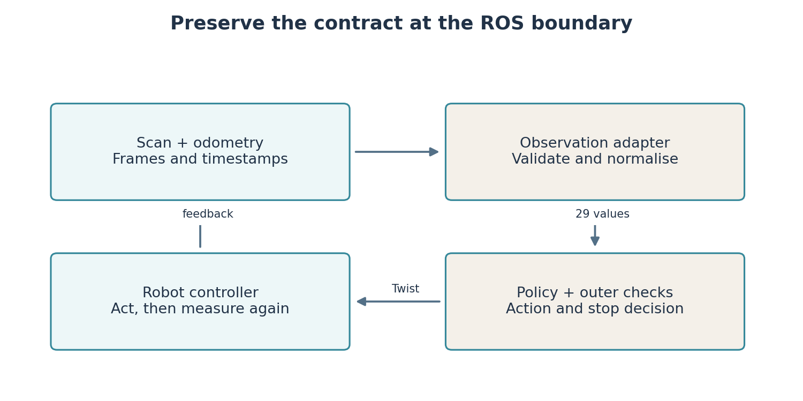
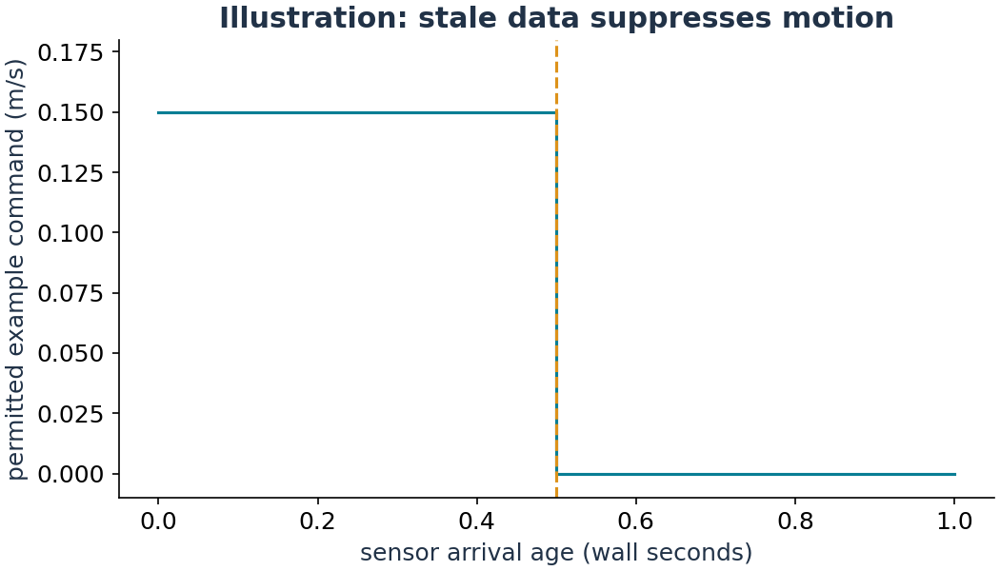

# Lab 9: Connect a learned policy to ROS and test the transfer

A policy trained in a numerical environment is a function, not a complete robot system. Live operation needs correctly ordered sensor values, consistent frames, fresh timestamps, the intended action scaling and a clear stopping rule.

**Your result:** run a policy on the Gazebo robot through ROS topics, record an actual episode and compare it with the lightweight simulator. You will also evaluate a hybrid controller and explain where its checks can and cannot help.

## Preserve the meaning of every input

Lab 7 and Lab 8 trained on 24 ranges, relative goal distance and direction, and body velocities. The ROS adapter must produce those same quantities. A correct array length is insufficient if the first range points forward in one environment and backward in another.

`teaching/ros_contract.py` samples directions from negative pi toward positive pi using the scan's angle metadata. It checks coverage and range validity. The simulator and robot model both place the laser 0.10 m ahead of the body. Goal direction is calculated relative to current body heading. The adapter obtains velocity from odometry, not from the last requested command.

For this first deployment, the goal is expressed in **odom**. It is a local experiment and does not need AMCL or a saved map. A map-frame goal would first need a time-consistent transform into the chosen control frame. Do not copy map coordinates from Lab 5 into this odometry interface without conversion.



## Establish a baseline episode in Gazebo

Start a fresh Gazebo session using Lab 2's launch. Stop Nav2, teleoperation and other velocity publishers first. Discover the odometry origin:

```bash
ros2 topic echo /odom --once
ros2 topic info /cmd_vel --verbose
```

Choose a nearby clear goal in odometry coordinates. In the usual fresh session an odometry goal (1,0) is roughly one metre ahead; verify the actual start and laser view. Run the supplied gap-following baseline:

```bash
ros2 run arc_course policy_driver --ros-args -p use_sim_time:=true -p policy:=gap -p goal_x:=1.0 -p goal_y:=0.0 -p duration:=60.0 -p output:=$HOME/arc_ws/results/lab09_gap.csv
```

The node subscribes to `/scan` and `/odom` and publishes `/cmd_vel`. It stops at the goal, at its wall-time limit, or when inputs or actions are invalid. A conservative proximity check suppresses motion near obstacles. This is a teaching safeguard, not a certified collision-avoidance system.

Watch actual body movement in Gazebo or the simulation RViz view. The output CSV records simulation time, odometry pose, goal distance, requested velocities and status. An existing output file is rejected so one episode cannot silently replace another.

## Replace the policy while keeping the interface

Restart Gazebo to obtain a fresh initial condition before the comparison. The runner does not secretly reset the world, robot state or random seed. Restarting must also restore the same relevant world conditions; record them.

```bash
ros2 run arc_course policy_driver --ros-args -p use_sim_time:=true -p policy:=ppo -p model:=$HOME/arc_ws/src/arc-course/models/lab08_dense.zip -p goal_x:=1.0 -p goal_y:=0.0 -p duration:=60.0 -p output:=$HOME/arc_ws/results/lab09_ppo.csv
```

To test the DQN checkpoint instead, select `policy:=dqn` and provide its `policy.pt` path. The action table must match the one used during training. Old models trained before an observation-contract change must be retrained; loading weights successfully does not prove semantic compatibility.

This is **inference**: using a fixed policy to choose commands. The ROS runner does not train inside Gazebo. A complete Gazebo training environment would additionally need reliable reset, reward calculation, episode boundaries and synchronised stepping. The repository's older experimental `arc_eval/ros_nav2_env.py` is not used as a completed training/reset interface.

## Explain a transfer failure before changing the learner

The lightweight environment applies velocities kinematically. Gazebo includes wheel dynamics, acceleration limits, contact and rendered sensor behaviour. The measured trajectory can differ even when observation sizes match. Sensor discretisation, noise and timing also matter.

The runner uses a steady wall-clock timer and checks arrival age, simulation timestamps and scan/odometry time separation. Its timeout checks therefore continue even if simulation time stops. Stale data causes zero commands. An unchanging simulation clock, wrong sensor frame or mismatched scan coverage is an interface failure, not evidence that PPO is inherently unsuitable.

**Student implementation:** read `from_pose` and `sample_laser` in `teaching/ros_contract.py`, then write your own adapter function in a separate student module. Given a synthetic pose and goal, reproduce the reference observation. Test goals ahead, behind and to the left, including the angle wrap boundary. Only replace the live adapter after these checks agree.

Inspect the driver's proximity threshold and timeout logic. Document what it checks and a scenario it cannot prove safe, such as an obstacle entering between samples. Distinguish an actual collision from a laser-proximity stop; the CSV status is not a contact sensor.

## Evaluate a hybrid policy and controlled disturbances

The supplied hybrid chooses between a learned policy and gap following based on risk and progress. A handover is a change in which policy is active. It does not establish correctness merely because two methods are available.

```bash
python3 -m teaching.rollout --policy hybrid --model models/lab08_dense.zip --seeds 500 501 502 --out results/lab09_hybrid
python3 -m teaching.rollout --policy ppo --model models/lab08_dense.zip --seeds 500 501 502 --noise 0.04 --delay 3 --out results/lab09_disturbed
```

These are surrogate experiments. Three control steps correspond to 0.15 simulated seconds at the 0.05 s update period. This delay applies to policy observations, not to physics integration. In the hybrid experiment, its progress monitor still receives the current simulated position; that is a stated limitation of the disturbance model.

Open the generated replays and compare matched seeds. You may also select `policy:=hybrid` in the ROS runner with the PPO model. The same outer sensor/proximity checks remain active.



## Make a claim that the evidence supports

Freeze configuration choices before opening final test seeds 1000–1009. Report the number of independent training seeds and evaluation episodes, success count, collision count, timeouts, elapsed time and path length where available. Do not describe a deterministic simulator rollout as a Gazebo measurement or a single successful run as general reliability.

Nav2 is a useful baseline, but comparisons need matched goals, initial poses, obstacles and success definitions. Its saved-map knowledge differs from a local learned policy's observation. State that information difference instead of attributing every outcome solely to the algorithm.

| Student work | Supplied integration | Generated files |
|---|---|---|
| Observation adapter tests and an explained experiment | `arc_course/arc_course/policy_driver.py` | Real ROS episode CSV |
| One justified hybrid/risk change | `starters/lab09/hybrid.py` | Surrogate metrics and replays |
| Final comparison with limitations | `teaching/rollout.py` | Evaluation report and model metadata |

## Research connection

Salimpour et al., *Sim-to-Real Transfer for Mobile Robots with Reinforcement Learning: from NVIDIA Isaac Sim to Gazebo and Real ROS 2 Robots*, 2025, studies a related pipeline and compares learned navigation with Nav2. Its reported transfer results belong to its tested systems, not automatically to this course robot. Use it to identify what assumptions a transfer experiment must document. [Paper and code links](https://arxiv.org/abs/2501.02902).

[Gymnasium's environment API](https://gymnasium.farama.org/api/env/) is useful when designing a future reset/step interface. [ROS 2 Jazzy QoS documentation](https://docs.ros.org/en/jazzy/Concepts/Intermediate/About-Quality-of-Service-Settings.html) explains sensor delivery compatibility.
